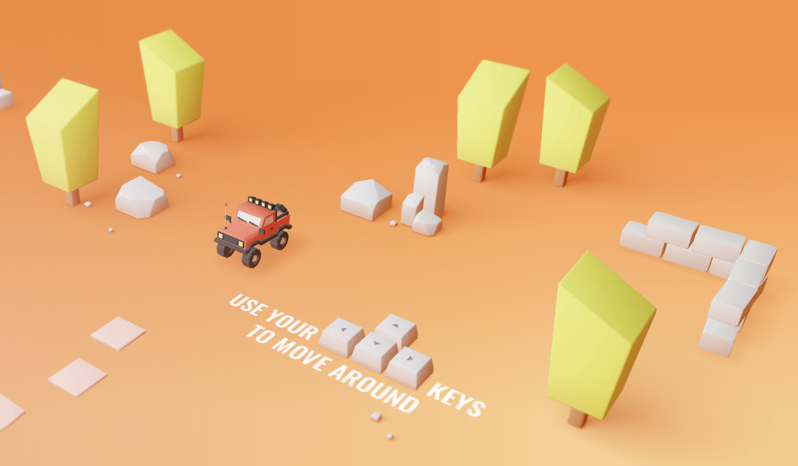

<h2># 🚗 *Interactive 3D Portfolio – Srivans Katriyar*<h2>  

A fully immersive, physics-driven *3D web portfolio* built using *Three.js, **WebGL, and **custom Blender models*
 
Navigate the world by driving a car, explore projects, certificates, skills, and interact with 3D objects in a visually rich environment.

  
## 🔗 Live Portfolio  
🚀 *Explore the interactive 3D experience here:*  
👉 *https://srivans-portfolio.netlify.app/*

  

  
---

## ✨ *Features*
 
### 🌐 *Interactive 3D Environment* 
Drive through a custom 3D world to explore different sections of the portfolio — projects, certificates, links, and more.
  
### 🎨 *Custom Blender Models* 
All world assets such as trees, signs, tiles, and props are modeled in Blender and exported in optimized GLTF/GLB format.
  
### 🧭 *Smooth Physics-Based Navigation* 
Car movement, rotation, acceleration, and camera following are implemented using custom physics logic.
  
### 🏗 *Modular Scene Architecture* 
A clean project structure separates rendering, world setup, physics, lighting, UI overlays, and model imports.
  
### ⚡ *Real-Time WebGL Rendering* 
Enhanced lighting, dynamic shadows, PBR materials, and baked textures powered by Three.js.
  
---

## 🛠 *Tech Stack* 

### *Frontend / Graphics Engine* 
- Three.js   
- WebGL   
- JavaScript (ES6 Modules)   
- GSAP (Animations)   
- GLTF / GLB Models   
- Vite / ESBuild   
 
### *3D Creation & Optimization* 
- Blender   
- GLTF Export   
- Texture Baking   
- Mesh Optimization   
 
### *Development Tools* 
- Node.js   
- NPM   
- Git / GitHub   
 
---

## 📁 *Project Structure*
 
/  
├── src/  
│ ├── javascript/  
│ │ ├── Application.js  
│ │ ├── World/  
│ │ ├── Utils/  
│ │ └── Materials/  
│ ├── models/  
│ │ ├── information/ 
│ │ └── projects/  
│ ├── style/   
│ └── index.js  
├── static/  
├── package.json  
└── README.md  
 

---

## 🚀 *Setup & Installation* 
 
# Install dependencies 
npm install 
 
# Start development server 
npm run dev 
 
# Build for production 
npm run build 
 
http://localhost:3000 
#

